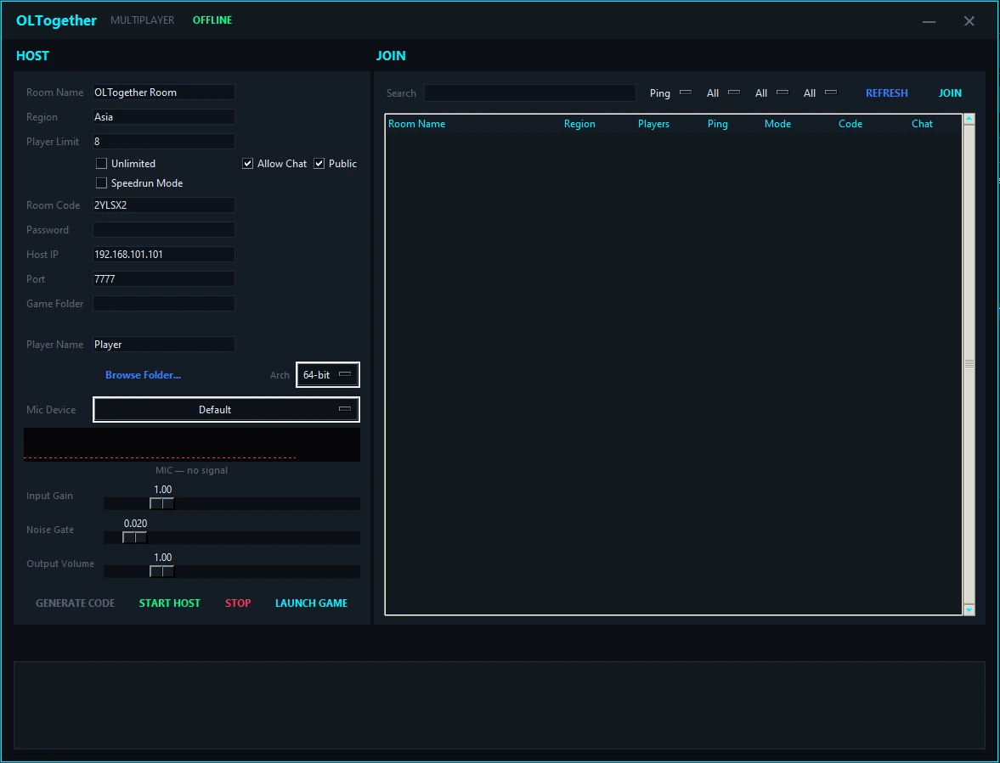
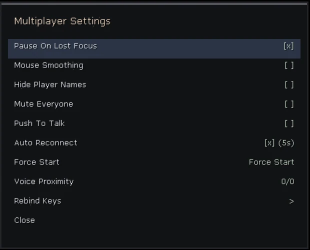

# Outlast Together
The main repository for the unofficial Outlast Multiplayer Mod.

Features:
- In-game Multiplayer Settings Menu (Press "~" key to open)
- Chat Box
- Proximity Voice Chat (Very WIP)
- Better GUI
- Better Room Creaton/Joining
- Stability.
- ... More

# Usage:
- Drag all the files into the Outlast root folder.
- Run Outlast from steam.
- Set your game path to the main Outlast Root Folder.
- Configure your room and press "START HOST" and Launch Game.

For Join:
- Refresh until you see a room you want to join, select it and press Join.

# Credits
- MeinaWithAI
- superboo007
- Twig6943
